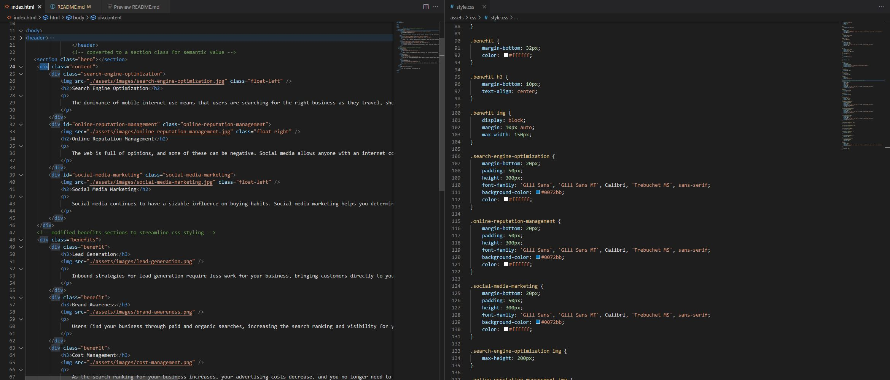

# fun-seo-reactor
## Introduction

The goal of this assignment was to refactor the HTML and CSS style code to meet the best accessibility standards. 

## Technologies

This project was completed using Visual Studio along with Chrome to inspect and modifiy site elements.

## Sources

Source material was obtained with the use of a github repository using gitlab class information.

## Setup

To run the completed project, the website can be opened in any browser such as Chrome, Firefox or Microsoft Edge.

## Features

The modified code illustrates examples of a nav type header layout, along with the use of sections to create a symantic layout. CSS styling was altered to remove any unneccesary information and to ensure the overall website design remains intact. 

## Visuals

The below visual is a screenshot of the coding process involved for this project

